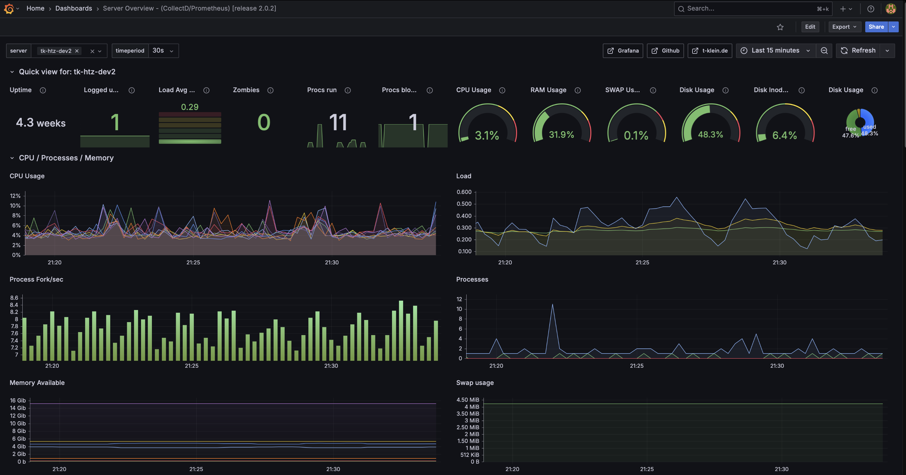
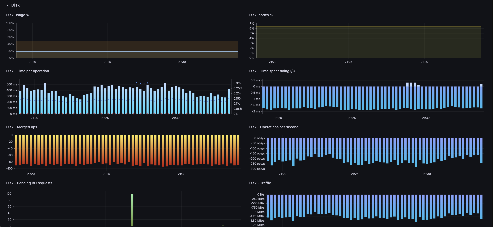
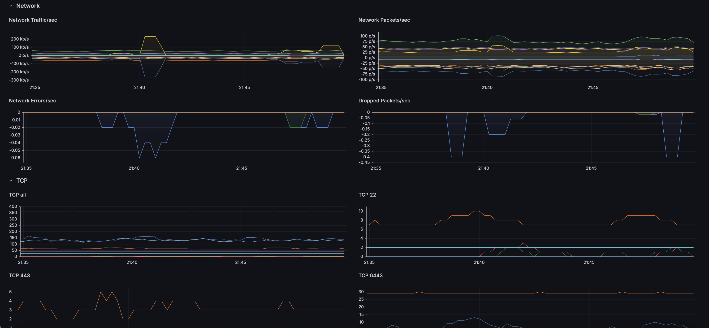
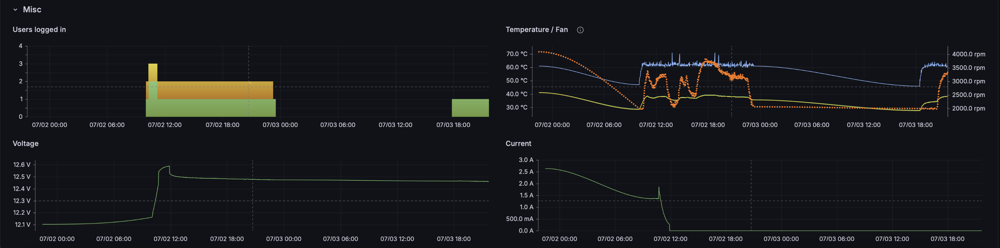

# Grafana Dashbords



## Collectd --> Prometheus --> Grafana

Published: [Grafana Dashboard](https://grafana.com/grafana/dashboards/23643-server-overview-collectd-prometheus-release-2-0-3/)  
Consultancy: [t-klein.de](https://www.t-klein.de)

### Features:
✅  multiple nodes select  
✅  datasource configurable on import  
✅  Quick view  
✅  Metric Panels  
✅   - Uptime  
✅   - Users  
✅   - CPU  
✅   - RAM  
✅   - Memory,Swap  
✅   - Processes/Load  
✅   - Disk Usage,Inodes,Ops  
✅   - Network Traffic,Errors,TCP  
✅   - Sensors Fan,Voltage,Current  


### CollectD Config
configure write_prometheus plugin and scrape using Prometheus, Mimir or OTEL Connector

```
LoadPlugin write_prometheus
<Plugin write_prometheus>
  Port "9103"
  Host "0.0.0.0"
</Plugin>
```
📌 See test config files in [collectd.d](docker/collectd/collectd.d) for more details on plugins.  

📌 Note that "Plugin cpu" uses "ValuesPercentage true" which differs from default config and is strictly needed to show correct panel.  


## Test
1. Run Docker compose in [docker](docker) to start an environment with CollectD, Prometheus and Grafana.  
2. Open Grafana UI at [localhost](http://127.0.0.1:8086) default login (admin/admin)
3. Configure Prometheus datasource: http://prometheus:9090
4. Import dashboard: [grafana_collectd_prometheus.json](grafana_collectd_prometheus.json)

## Acknowledgements
Grafana Trademark see [grafana.com](https://grafana.com)


## License
licensed under the MIT license — see the [LICENSE](LICENSE) file for details.

